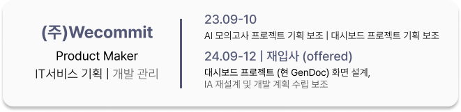

안녕하세요! 게임 시스템/콘텐츠 기획자로서의 성장을 기록하고 있는 고예린입니다.  
이 저장소는 제가 직접 참여한 프로젝트의 프로토타입, 기획서, 개발 기록 등을 정리한 공간입니다.  

⚡ **빠른 이동**

---

# Experience
## 경력
### 근무 경험

## 협업 경험
### 게임 기획
이미지 클릭 시 해당 프로젝트 설명으로 이동합니다.

  

---

## 배움
### 학력

- 20, 21 소프트웨어 학부 집행부 (소프트웨어융합전공 부과대)  
- 22 소프트웨어 학부 소속 개발 프로젝트 학회 <APPS> 회장  

### 교육 이수

---

<!-- Interests 섹션 필요시 다시 열기

### Interests  

🎯 좋아하는 장르: MMORPG / 시뮬레이션 / 스토리 중점 게임  
🔍 현재 관심 분야: 글 밖에서 전달하는 스토리텔링, 생활 컨텐츠  

-->

### Links 

  

