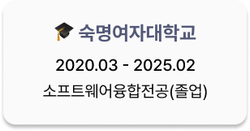

안녕하세요! 게임 시스템/콘텐츠 기획자로서의 성장을 기록하고 있는 고예린입니다.  
이 저장소는 제가 직접 참여한 프로젝트의 프로토타입, 기획서, 개발 기록 등을 정리한 공간입니다.
상세한 기록은 **카드**와 **Pinned Repository**에서 확인하실 수 있습니다!
 **빠른 이동**

---

# Experience
## 경력
### 근무 경험
- **(주) Wecommit** 단기 계약 근무 (23.09-23.10,종료)
  - AI 모의고사 프로젝트, 대시보드 프로젝트 기획 보조
-  **(주) Wecommit** 대시보드 프로젝트 (현 GenDoc) 기획
    - 프로젝트 화면 설계
    - 레거시 자료 통합 및 팀 협업 공간 세팅
    - IA 재설계 보조, 개발 계획 수립 보조
## 협업 경험
### 게임 기획
이미지 클릭 시 해당 레포지토리로 이동합니다. 
 

## 배움
### 학력

- 20, 21 소프트웨어 학부 집행부 (소프트웨어융합전공 부과대)
- 22 소프트웨어 학부 소속 개발 프로젝트 학회 <APPS> 회장

### 교육 이수

<!-- **24.06-24.09** | 게임 기획부터 출시까지 A to Z (354시간) 
이수
 *청년취업사관학교 강북캠퍼스 게임 기획과정 1기*
 **24.12-25.09** | 멀티 플랫폼 메타버스 게임 기획자 부트캠프 (1368시간) 수료
  *교육 기관: 경일게임IT아카데미*-->

---
### Interests
- 🎯 좋아하는 장르: MMORPG / 시뮬레이션 / 스토리 중점
- 🔍 현재 관심 분야: 글 밖에서 전달하는 스토리텔링

### Links

---

<!-- ## 🗂️ Repository Highlights

## 🧪 Prototype Demos

- 📁 `prototypes/` 폴더 내에서 직접 플레이 가능한 Unity 프로토타입 포함
- 영상/스크린샷으로 기능과 UI 시연 추가 예정 -->

